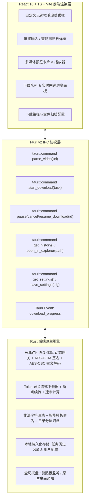

# Free Video Downloader 桌面端无水印视频下载器设计方案

## 1. 项目概述

Free Video Downloader 是一个基于 **Tauri v2 + React 18 + TypeScript + Vite + Tailwind CSS** 技术栈构建的高性能跨平台桌面无水印视频与媒体资源下载工具。

核心解析能力基于对 `hellotik.app` 逆向工程获得的端到端加密通信协议，支持对抖音（Douyin）、TikTok、小红书（Rednote）、快手（Kuaishou）、Instagram、Bilibili 等多社交平台的短视频、图集、LivePhoto 实况图片及音频进行秒级解析，并提供多清晰度（540p、720p、1080p、4K原画）无水印下载、断点续传与智能本地文件归档管理。

---

## 2. 系统技术架构与选型



### 2.1 技术选型清单

| 层级 | 技术选型 | 版本/库 | 用途 |
|---|---|---|---|
| **桌面核心** | Tauri v2 | `2.x` | 原生跨平台桌面外壳、IPC桥接、系统级集成 |
| **后端语言** | Rust | `2021 Edition` | 加解密解析引擎、异步流式下载、文件系统操作 |
| **Rust 异步/网络** | Tokio + Reqwest | `tokio 1.x`, `reqwest 0.12 (stream, json)` | 高并发非阻塞 I/O、HTTP请求 |
| **Rust 加解密** | AES + CBC + SHA2 + Base64 | `aes 0.8`, `cbc 0.1`, `sha2 0.10`, `base64 0.22`, `aes-gcm 0.10` | 完整还原 HelloTik 协议加解密 |
| **前端框架** | React + TypeScript | `React 18.3`, `TypeScript 5.x` | 响应式声明式组件开发 |
| **构建工具** | Vite | `Vite 6.x` | 极速热更新与现代前端打包 |
| **样式与动效** | Tailwind CSS + Lucide Icons | `Tailwind CSS 3.4`, `lucide-react` | 现代极简设计语言、深色模式、精美图标库 |
| **状态/交互** | Sonner | `sonner` | 现代优雅 Toast 消息提示 |

---

## 3. HelloTik 端到端加密解析协议规范

通过对 HelloTik Web 客户端与服务端通信机制的逆向分析，其完整通信由三个核心阶段组成：

### 3.1 阶段一：动态网关鉴权 (Gate Auth)

- **请求端点**：`POST https://www.hellotik.app/api/gate-e5eea8`
- **请求头**：`Content-Type: application/json`, `User-Agent: Mozilla/5.0 ...`
- **请求体 Payload**：
  ```json
  {
    "requestURL": "<用户输入的完整短视频分享文本或URL>",
    "isBatch": false,
    "mode": "single"
  }
  ```
- **响应数据格式**：
  ```json
  {
    "success": true,
    "tk_e5eea8": "<ticket_string>",
    "sd_e5eea8": "<enc_seed_string>",
    "ex_e5eea8": "2026-08-31T03:02:44.265Z"
  }
  ```

### 3.2 阶段二：请求信封加密 (AES-GCM)

1. **密钥派生 (Key Derivation)**：
   $$\text{DerivedKey} = \text{SHA-256}(\text{ticket} + ":" + \text{encSeed})$$
2. **IV 生成**：生成 12 字节加密安全随机数。
3. **明文载荷构造**：
   ```json
   {
     "requestURL": "<原始文本/链接>",
     "isMobile": "false",
     "isoCode": "CN",
     "adType": "adsense",
     "uwx_id": "uwxs_<random_id>",
     "successCount": "0",
     "totalSuccessCount": "0",
     "firstSuccessDate": null,
     "geoipIp": ""
   }
   ```
4. **加密运算**：使用 `AES-256-GCM` 算法对载荷 UTF-8 字节流进行加密，得到密文与认证标签。
5. **提交解析请求**：
   - **请求端点**：`POST https://www.hellotik.app/api/parse`
   - **请求体**：
     ```json
     {
       "tk_e5eea8": "<ticket_string>",
       "pl_e5eea8": "<base64_ciphertext_with_tag>",
       "iv_e5eea8": "<base64_12byte_iv>",
       "vr_e5eea8": 1
     }
     ```

### 3.3 阶段三：响应密文解密 (AES-256-CBC)

服务端在状态码 200 时返回如下加密信封：
```json
{
  "status": 0,
  "encrypt": true,
  "data": "<enc_data_base64>",
  "key": "<enc_key_base64>"
}
```

解密流水线分为四步：

1. **Base64 解码与逐字节 XOR 90**：
   $$C_1 = \text{atob}(\text{data}), \quad I_1 = \text{atob}(\text{key})$$
   $$C_2[n] = C_1[n] \oplus 90, \quad I_2[n] = I_1[n] \oplus 90$$
2. **8 字符分块倒序 (Chunk Reversal)**：
   将字符串每 8 个字符切片后分别进行字符翻转逆序重组。
3. **自定义密码本置换映射 (Custom Substitution Table)**：
   - 映射源（HelloTik 特征表）：`"ZYXABCDEFGHIJKLMNOPQRSTUVWzyxabcdefghijklmnopqrstuvw9876543210-_"`
   - 映射目标（标准 Base64 字符表）：`"ABCDEFGHIJKLMNOPQRSTUVWXYZabcdefghijklmnopqrstuvwxyz0123456789+/"`
4. **标准 AES-256-CBC 解密**：
   - 固定主密钥：`"93838338562359368888868323563256"`（UTF-8 编码为 32 字节）
   - IV：第 3 步变换后字符串的 Base64 字节流
   - 密文：第 3 步变换后字符串的 Base64 字节流
   - 填充方式：`PKCS#7`
   - 解密后解码为 UTF-8 字符串，解析为标准 JSON 视频元数据。

---

## 4. 数据结构与模型设计

### 4.1 解析输出实体 (`VideoParseResult`)

```typescript
export interface VideoQualityInfo {
  type: string;        // "540p" | "720p" | "1080p" | "超高清" / "原画"
  url: string;         // 无水印直链
  size?: number;       // 文件大小 (字节)
  formattedSize?: string; // "87.8 MB"
}

export interface VideoItem {
  url: string;         // 默认主视频直链
  video_fullinfo?: VideoQualityInfo[]; // 多清晰度列表
}

export interface VideoParseResult {
  title: string;       // 视频标题/文案
  author?: string;     // 作者昵称
  cover: string;       // 封面图直链
  avatar?: string;     // 作者头像
  platform: string;    // "douyin" | "tiktok" | "rednote" | "kuaishou" | "bilibili" | "other"
  videos: VideoItem[]; // 视频列表
  pics?: string[];     // 图集列表（针对图文/LivePhoto）
  audioUrl?: string;   // 背景音频 MP3 直链
  sourceUrl: string;   // 原始分享链接
}
```

### 4.2 下载任务实体 (`DownloadTask`)

```typescript
export type TaskStatus = 'pending' | 'downloading' | 'paused' | 'completed' | 'failed' | 'cancelled';

export interface DownloadTask {
  id: string;          // 唯一任务 UUID
  title: string;       // 资源名称
  platform: string;    // 平台
  mediaType: 'video' | 'image' | 'audio' | 'album';
  quality?: string;    // "1080p" / "超高清"
  downloadUrl: string; // 下载直链
  savePath: string;    // 本地绝对存储路径
  totalBytes: number;  // 总字节数
  downloadedBytes: number; // 已下载字节数
  progress: number;    // 0 ~ 100
  speed: number;       // 当前速度 (字节/秒)
  status: TaskStatus;  // 任务状态
  errorMessage?: string;
  createdAt: number;   // 创建时间戳
  completedAt?: number;// 完成时间戳
}
```

### 4.3 用户配置模型 (`AppSettings`)

```typescript
export interface AppSettings {
  defaultDownloadDir: string;      // 默认下载目录（默认: ~/Downloads/FreeVideoDownloader）
  autoOrganizeByAuthor: boolean;   // 是否按作者建立子目录
  autoOrganizeByDate: boolean;     // 是否按日期建立子目录
  namingTemplate: string;          // 命名模板: "{author}_{title}_{quality}"
  autoMonitorClipboard: boolean;   // 是否开启剪贴板智能监听
  maxConcurrentDownloads: number;  // 最大并发下载数 (默认 3)
  theme: 'dark' | 'light' | 'system'; // 主题模式
  closeToTray: boolean;            // 关闭窗口时最小化到系统托盘
}
```

---

## 5. Tauri IPC 接口定义

### 5.1 命令列表 (`Commands`)

| 命令名称 | 参数 | 返回值 | 说明 |
|---|---|---|---|
| `parse_video` | `{ raw_input: String }` | `Result<VideoParseResult, String>` | 传入分享文本/URL，执行 HelloTik 逆向协议解析 |
| `start_download` | `{ task_req: CreateDownloadTaskRequest }` | `Result<String, String>` | 创建并启动下载任务，返回任务 ID |
| `pause_download` | `{ task_id: String }` | `Result<(), String>` | 暂停指定下载任务 |
| `resume_download` | `{ task_id: String }` | `Result<(), String>` | 恢复/断点续传指定下载任务 |
| `cancel_download` | `{ task_id: String }` | `Result<(), String>` | 取消并移除指定下载任务 |
| `get_download_history` | `()` | `Result<Vec<DownloadTask>, String>` | 获取历史下载记录 |
| `clear_download_history`| `()` | `Result<(), String>` | 清空下载历史记录 |
| `open_file_in_folder` | `{ file_path: String }` | `Result<(), String>` | 在系统资源管理器中定位高亮指定文件 |
| `open_folder` | `{ folder_path: String }` | `Result<(), String>` | 打开指定文件夹 |
| `get_app_settings` | `()` | `Result<AppSettings, String>` | 读取用户偏好配置 |
| `save_app_settings` | `{ settings: AppSettings }` | `Result<(), String>` | 保存用户偏好配置 |
| `select_directory` | `()` | `Result<Option<String>, String>` | 打开系统原生目录选择对话框 |

### 5.2 事件广播 (`Events`)

- `download://progress`: 广播任务实时下载状态更新（`id`, `downloadedBytes`, `totalBytes`, `progress`, `speed`, `status`）。
- `download://completed`: 单个任务完成通知。
- `download://failed`: 任务失败告警通知。
- `clipboard://detected`: 监听到匹配的短视频链接时触发。

---

## 6. 前端 UI/UX 与组件架构

```
src/
├── assets/                  # 静态资源与矢量图形
├── components/
│   ├── layout/
│   │   ├── TitleBar.tsx     # 自定义无边框窗口顶栏（拖拽区域、最小化/最大化/关闭按钮）
│   │   └── AppLayout.tsx    # 整体布局外壳（侧边导航与内容工作区）
│   ├── parser/
│   │   ├── UrlInputBox.tsx  # 多功能输入框（粘贴、清空、批量多行输入开关、解析按钮）
│   │   ├── ClipboardModal.tsx# 剪贴板链接自动弹出检测通知卡片
│   │   └── BatchInputModal.tsx# 批量解析输入对话框
│   ├── media/
│   │   ├── MediaResultCard.tsx # 解析成功后的多媒体富卡片
│   │   ├── QualityBadge.tsx # 清晰度标签与大小展示
│   │   ├── VideoPlayerModal.tsx# 内置无水印高清视频预览播放器
│   │   └── ImageGalleryModal.tsx# 图集/LivePhoto 瀑布流与放大预览
│   ├── download/
│   │   ├── DownloadQueue.tsx# 实时下载任务列表（速率波形、进度条、暂停/重试控制）
│   │   ├── HistoryList.tsx  # 已完成历史面板（搜索、按平台过滤、在文件夹中打开）
│   │   └── TaskItem.tsx     # 单个任务卡片
│   └── settings/
│       └── SettingsModal.tsx# 用户偏好设置（下载路径、命名规则、主题偏好、托盘设置）
├── hooks/
│   ├── useClipboard.ts      # 智能剪贴板监听 Hook
│   ├── useDownloadManager.ts# 下载队列状态订阅与控制 Hook
│   ├── useVideoParser.ts    # 视频解析与状态维护 Hook
│   └── useTheme.ts          # 深浅色主题切换 Hook
├── services/
│   └── tauriApi.ts          # 封装所有 Tauri invoke 命令与 event 监听
├── types/
│   └── index.ts             # TypeScript 类型定义
├── App.tsx                  # 主页面组织入口
├── main.tsx                 # React DOM 渲染入口
└── index.css                # 全局样式、设计系统 Tokens 与 Tailwind 指令
```

---

## 7. 错误处理与容错机制

1. **网络超时与连接重试**：
   - HelloTik 请求超时设置为 15 秒，网络异常自动重试 2 次。
2. **下载断点续传**：
   - 下载器在写入文件前检测本地是否存在同名 `.part` 临时文件，若存在则发送带 `Range: bytes=X-` 的 HTTP 请求继续写入。
3. **非法文件名过滤**：
   - 自动将短视频文案中的换行符、Emoji 及 Windows 保留字符（`\ / : * ? " < > |`）过滤或替换为下划线，并将标题长度安全截断至 64 字符以内。
4. **CORS 与直链过期防护**：
   - 所有媒体下载直接通过 Rust `reqwest` 在本地发起，带标准 Referer 和 User-Agent 伪装，彻底绕过 Webview 的 CORS 限制与防盗链检测。

---

## 8. 实施与验证路线

1. **阶段 1：项目脚手架与基础环境搭建**
   - 使用 Vite + React + TypeScript 初始化前端。
   - 初始化 Tauri v2 结构并配置必要的官方插件（fs, dialog, opener, clipboard, notification）。
2. **阶段 2：Rust 逆向解析引擎实现与单元测试**
   - 实现 `parser.rs` 中的 Gate 鉴权、AES-GCM 请求加密与 AES-CBC 响应解密算法。
   - 使用抖音测试链接（`https://v.douyin.com/LTjjepu4yFg/`）进行自动化测试验证。
3. **阶段 3：Rust 高性能下载器与存储引擎实现**
   - 实现流式多线程下载、断点续传、实时进度 Event 广播及文件管理。
4. **阶段 4：React 前端核心组件与现代 UI 开发**
   - 实现自定义无边框顶栏、输入解析器、多清晰度选择器、预览播放器、下载管理看板。
5. **阶段 5：桌面端深度集成与端到端系统验收**
   - 剪贴板监听、系统托盘、暗黑模式切换、多平台真机解析下载实测与构建验证。
